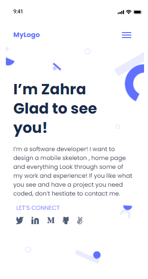

# My portfolio
creating a portfolio website
 
# Portfolio

> its a template webpage designed with a web developing style. 
> this project contain:
> - home page : introduction to developer
> - works page : some example cards showing sample designes
> - about us page : information of creater and contact informations
> the home page of this project look like this :

## Built With

- HTML
- CSS

## Live Demo
live demo will be add after finishing the project.
- [Live Demo Link:](https://rawcdn.githack.com/ZahraArshia/microverse-project1/79e1928e4f5921c693c1180bca1d5c1c0f3c0369/works.html)

## Getting Started
no specification or installation is needed to run this project. but you can modify and pesonalize it by changing the contect or adding lists.

## Authors

👤 **Zahra**

- GitHub: [@githubhandle](https://github.com/ZahraArshia)

## Show your support

Give a ⭐️ if you like this project!

## 📝 License

This project is MIT licensed.

