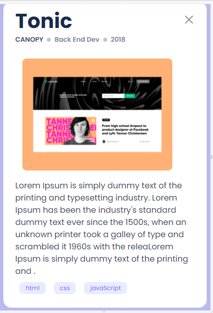

# microverse-portofolio
Creating pop-up window for both Mobile and Desktop versions 
 
# Portfolio: Pop-up window

> its a webpage designed by implementing the forms on it. 
> this project contain:
> - A pop-up window for Mobile version.
> - A pop-up window for Desktop version
> - Using buttons to access the pop-ups

## Built With

- HTML
- CSS
- JavaScript
- Visual Studio Code

## Live Demo
live demo will be add after finishing the project.
[Live Demo Link : responsive version ](https://raw.githack.com/ZahraArshia/my-portfolio/responsive-version/zahra-portfolio.html)

## Authors

👤 **Zahra**

- GitHub: [@githubhandle](https://github.com/ZahraArshia)

👤 **Moise Mulungu**

- GitHub: [@githubhandle](https://github.com/moise-mulungu)

## Show your support

Give a ⭐️ if you like this project!

## 📝 License

This project is MIT licensed.
