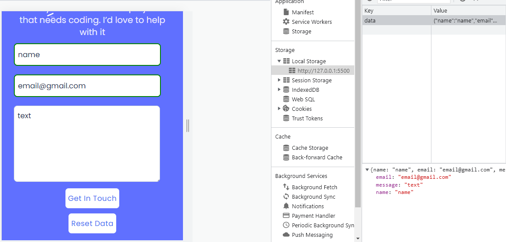

# microverse-portofolio
Implementing the Browser Data Storage 
 
# Portfolio: Preserve Data

> its a webpage designed by implementing the browser data storage. 
> this project contains:
> - A reset button.
> - A Get in touch button
> - Local storage method.

## Built With

- HTML
- CSS
- JavaScript
- Visual Studio Code

## Live Demo
live demo will be add after finishing the project.
[Live Demo Link : responsive version ](https://raw.githack.com/ZahraArshia/my-portfolio/responsive-version/zahra-portfolio.html)

## Authors

👤 **Zahra**

- GitHub: [@githubhandle](https://github.com/ZahraArshia)

👤 **Moise Mulungu**

- GitHub: [@githubhandle](https://github.com/moise-mulungu)

## Show your support

Give a ⭐️ if you like this project!

## 📝 License

This project is MIT licensed.
